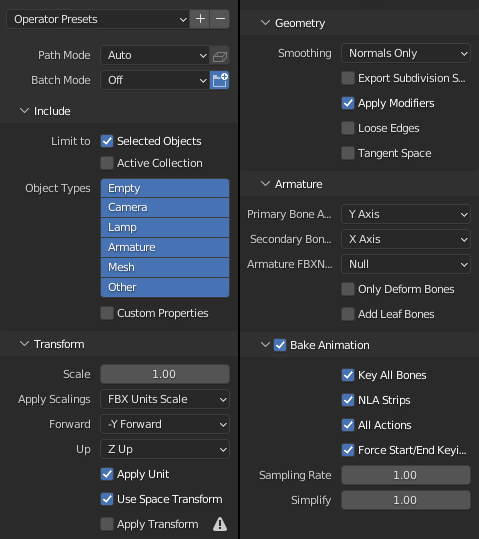
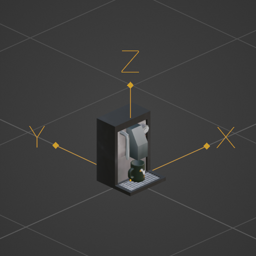
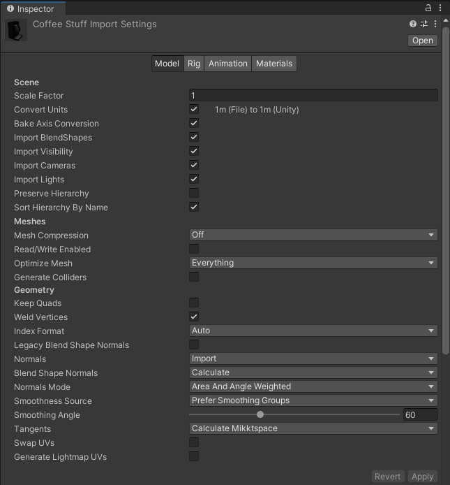
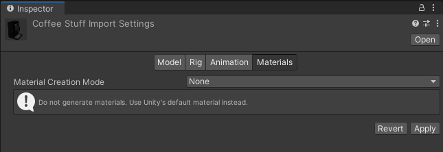

# 1. Blender
1. Keep everything at a realistic scale.
2. Remember to apply all transforms (`Ctrl+A`)
3. Export options, see screenshot:

A note on axis:  By default Blender treats the `-Y` axis as forward,
like in this model:

If you stuck to this convention, select "-Y forward".  If your model
faces a different way, select the appropriate axis as "forward".
In any case, `Z` will be the "up" axis.

# 2. GIMP/Krita/PS/Paint/etc
1. Texture size should be a power of two (e.g. 1024x1024, 2048x2048,
  512x1024, 32x32, ...)

# 3. Unity
1. Import settings:
    * Scale Factor: 1
    * Tick the following:
        * Convert Units
        * Bake Axis Conversion
        * Import thingies
    * Materials:  Material Creation Mode:  None

2. Put the object into the scene
3. Create a material with the "Custom/Simple Lit Affine" shader
    * set the texture, and
    * drag&drop it onto the object, et voilá!
4. Create an Original Prefab by drag&dropping the object from the Scene
   Hierarchy into the `Assets/Prefabs` directory.

And remember:  It's Commitwoch my Kerl\*innen!
